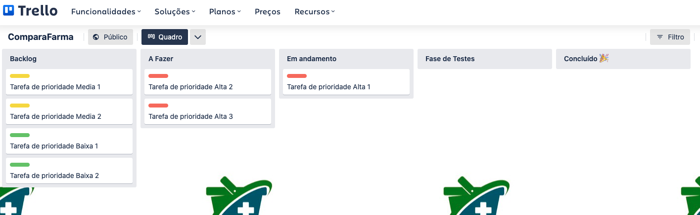
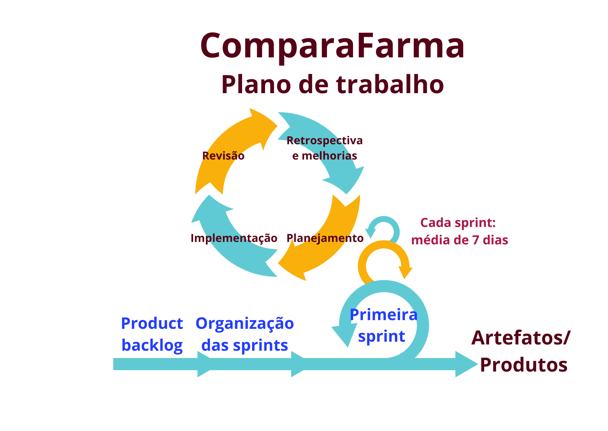

# Metodologia 
	
A metodologia consiste nas definições de ferramentas utilizadas pela equipe tanto para a manutenção do código fonte quanto para a organização do time na execução das tarefas do projeto.  
	
## Relação de Ambientes de Trabalho 
	
Os artefatos do projeto serão desenvolvidos nas plataformas apresentadas pelo quadro a seguir. 

|Ambiente    | Plataforma (Link) |  
|------|-----------------------------------------|
|Repositório de código fonte |  <a href="https://github.com/ICEI-PUC-Minas-PMV-ADS/pmv-ads-2023-1-e1-proj-web-t9-time2-comparafarma"> GitHub</a> | 
|Documentos do projeto| <a href="https://github.com/ICEI-PUC-Minas-PMV-ADS/pmv-ads-2023-1-e1-proj-web-t9-time2-comparafarma"> GitHub </a> | 
|Projeto de Interface e Wireframes| <a href="https://marvelapp.com/project/6697194"> Marvel </a> | 

## Gerenciamento do Projeto 

A equipe utiliza metodologias ágeis, tendo escolhido o Scrum como base para a definição do processo de desenvolvimento. A equipe está organizada da seguinte maneira: 
- Product Owner: Marco Rodrigo Costa 
- Scrum Master: Christiane Curi Pereira  
- Equipe de Desenvolvimento: Bruno Henrique Comassetto, Gabriel Mautone Costa, Jonathan Francisco Rocha de Castro, Murilo Henrique Souza Ignacio e Priscila Amaral Diniz 

Para organização e distribuição das tarefas do projeto, a equipe está utilizando o Trello estruturado com as seguintes colunas: 
- Backlog: contém as tarefas a serem trabalhadas e representa o Product Backlog. Todas as atividades identificadas no decorrer do projeto também devem ser incorporadas a esta lista. 
- A fazer: esta lista representa o Sprint Backlog. Nela constam as atividades pendentes a serem iniciar. 
- Em andamento: nesta coluna constam os sprints que estão sendo realizados, ou seja, as atividades que estão em curso. 
- Fase de testes: Lista as tarefas que estão passando pelo controle de qualidade antes de serem entregues ao cliente. 
- Concluído: Nesta lista são colocadas as tarefas que passaram pelos testes e controle de qualidade e estão prontos para ser entregues ao usuário. Não há mais edições ou revisões necessárias nessas versões. 

O quadro kanban do grupo desenvolvido na ferramenta de gerenciamento de projetos está disponível através da URL https://trello.com/b/EH10wmgQ/comparafarma.

**Figura 1** – Imagem da tela do Trello, com atividades a serem desenvolvidas. 

A organização da metodologia de trabalho é baseada no método Scrum e efetivado em sprints, sendo a seguir apresentada uma lista de sprints planejadas pelo grupo. O planejamento é de que cada sprint tenha duração de 7 dias, com entrega de artefatos intermediários.  

**Figura 2** – Esquema de trabalho, no modelo Scrum, da equipe envolvida na confecção do ComparaFarma.

A seguir são apresentadas algumas sprints que foram elaboradas como previsão de trabalho, já na ordem de sua execução, de acordo com as prioridades dos requisitos e Product backlog: 
1. Criação da área de trabalho no Trello; 
2. Inserção do projeto no GitHub; 
3. Definição do Fluxo do Usuário 
4. Projeto de interface da tela 1; 
5 Projeto de interface da tela 2; 
6. Atualização dos dados no GitHub; 
7. Projeto de interface da tela 3; 
8. Projeto de interface da tela 4; 
9. (...) 
	