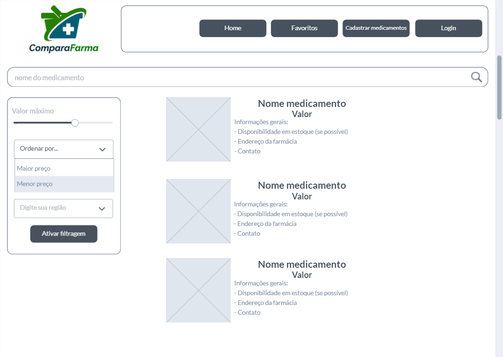

# Projeto de Interface

A interface do ComparaFarma prevê tela inicial e telas posteriores a serem acessadas pelos usuários. Para tal, a equipe elaborou fluxos de telas, tanto na visão do cliente como do dono do estabelecimento de venda de medicamentos.

## Fluxo do Usuário

De acordo com as histórias de usurários relatadas, sabe-se que o principal usuário do sistema será o cliente que compra medicamentos e busca comparar e o outro usuário do sistema ComparaFarma é o dono da Farmácia, que insere seus produtos a serem vendidos e acompanha os acessos dos clientes. Assim, foi estabelecido o fluxo para estes usuário.

**Figura 3** - Fluxo dos usuários

**Figura 2** - Fluxo dos usuários na forma de wireframes.

## Wireframes

Conforme o fluxo estabelecido nas figuras 3 e 4, a equipe elaborou cada uma das telas que podem ser acessadas pelos usuários da aplicação, conforme apresentado nas figuras que se seguem. Sequencialmente, são apresentadas: tela inicial ou homepage, tela de cadastro de medicamentos, tela de login, tela de resultado da pesquisa e tela de favoritos.

**Figura 5** - Homepage da aplicação. Tela visualizada ao acessar a aplicação.

**Figura 6** - Tela de cadastro de medicamentos, procedimento que deve ser feito pelo dono da farmácia.

**Figura 7** - Tela de login, sendo uma tela que serve tanto para o dono da farmácia, quanto para o cliente que fará a busca.

**Figura 8** - Tela de resultado da pesquisa, onde serão apresentados os preços comparativos conforme pesquisa feita pelo cliente.

**Figura 9** - Tela de favoritos, onde serão apresentados os produtos que o cliente favoritou para facilitar comparações de preços futuras.

