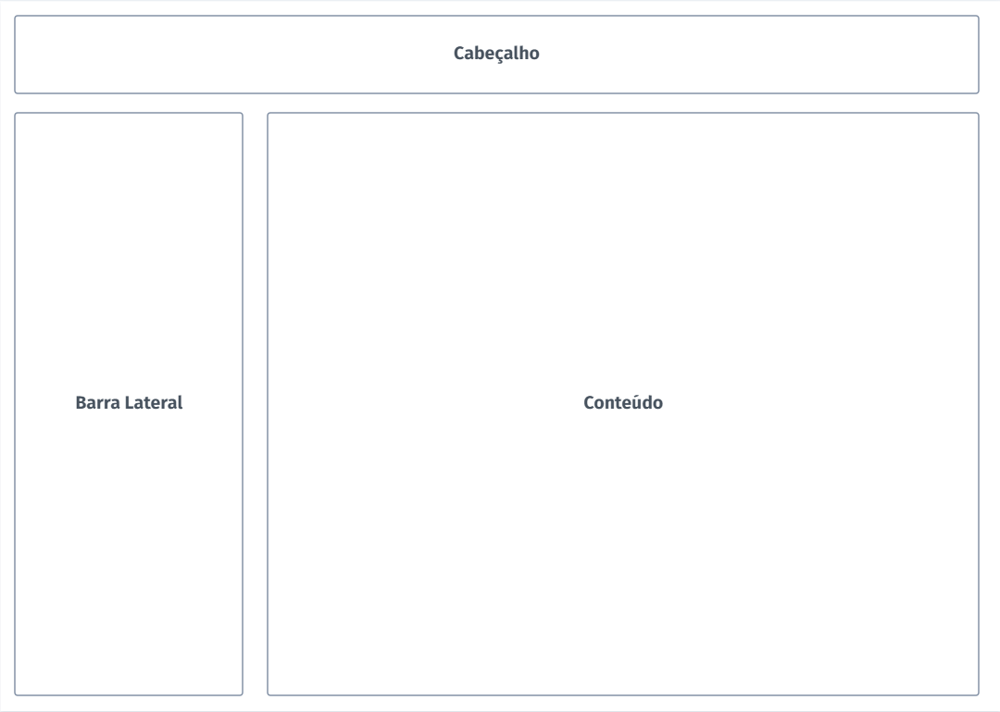
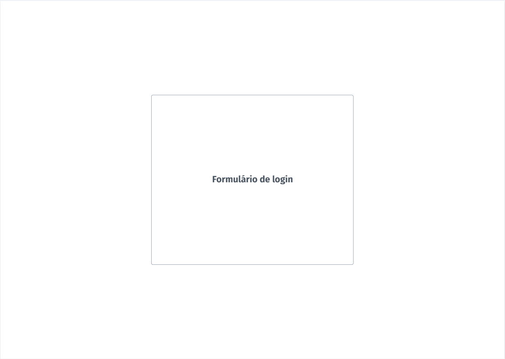
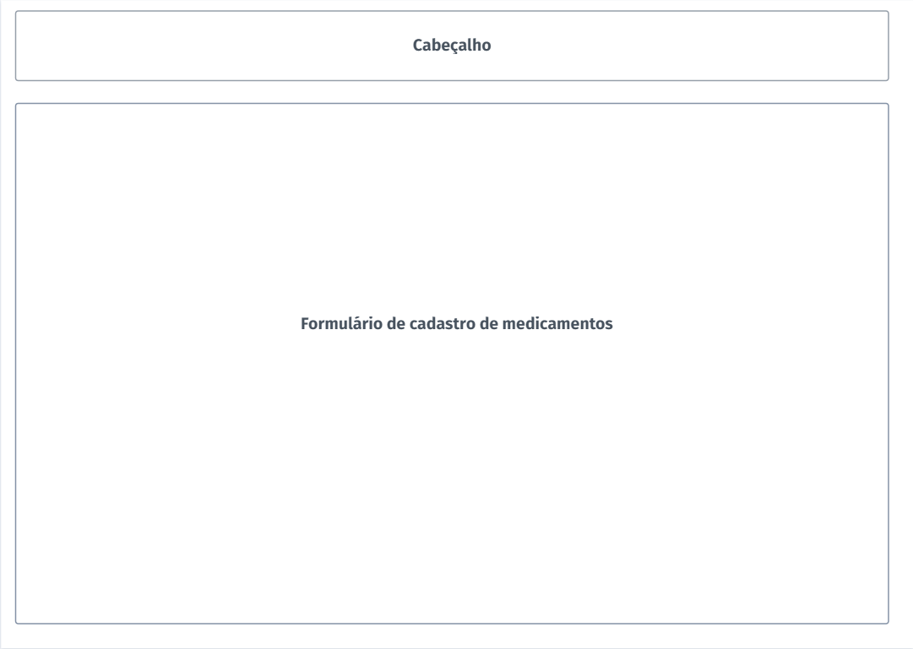

# Template do site

O template criado está disponível no site https://github.com/ICEI-PUC-Minas-PMV-ADS/pmv-ads-2023-1-e1-proj-web-t9-time2-comparafarma.git e é composto pelos seguintes layouts:

- Tela principal
- Login
- Cadastro de medicamentos

A responsividade segue o padrão do Bootstrap

## Tela Principal
Tela que abrange a Homepage, o resultado de pesquisa e a página de favoritos.

## Login
Esste layout é utilizado na tela de login de usuários da aplicação.

## Cadastro de medicamentos
Formulário destinado ao usuário que deseja cadastrar seus medicamentos no sistema.

