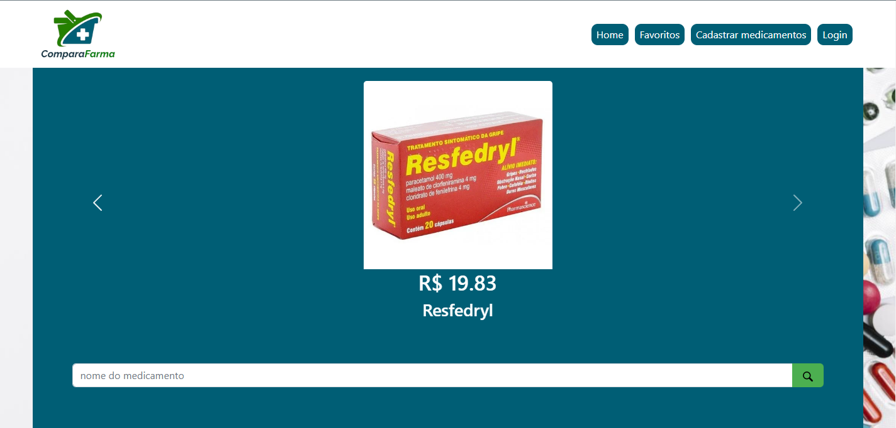
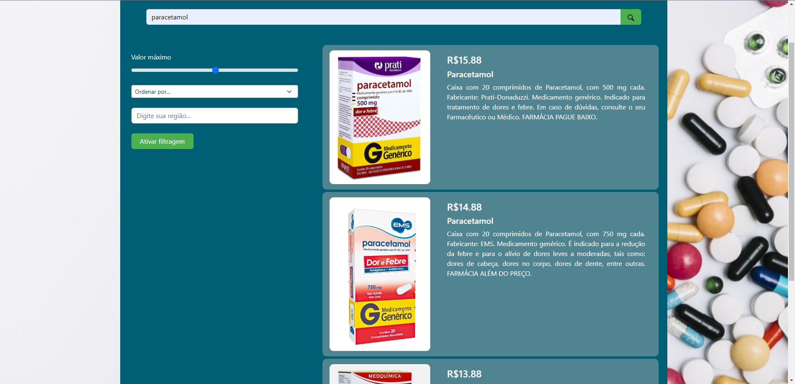
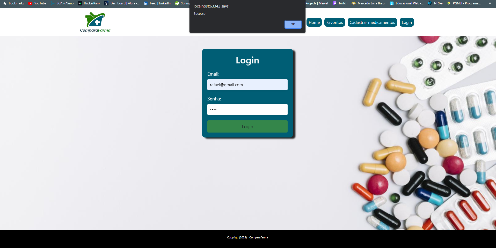
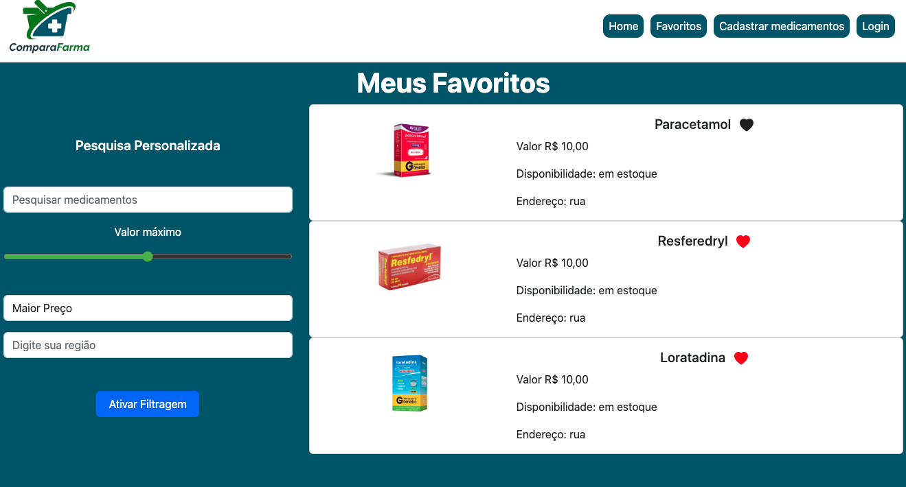

# Programação de Funcionalidades

Nesta seção são apresentadas as telas desenvolvidas para cada uma das funcionalidades
do sistema. O respectivo endereço (URL) e outras orientações de acesso são
apresentadas na sequência.

## Homepage (RF-01)
A homepage do sistema apresenta um card contendo os medicamentos com menores preços.
Foi criado um aquivo "script_pesquisa.js" contendo uma estrutura de dados baseada em JSON,
servindo como um banco de dados para alimentar os cards. A tela também apresenta um campo
para que o usuário possa efetuar uma pesquisa pelo nome do medicamento desejado.



**Resuisitos atendidos**

- RF-01 

**Artefatos da funcionalidade**

- home.html
- style.css
- script_pesquisa.js
- lupa.png

**Estrutura de dados**

````
{
  dados: [
    {
      nome: "Paracetamol",
      preco: 15.88,
      imagem: "../img/paracetamol1.PNG",
      descricao:
        "Caixa com 20 comprimidos de Paracetamol...",
    },
    ...
  ]
}
````

**Instruções de acesso**

1. Abra um navegador de Internet e informe a seguinte URL:
2. A homepage é a primeira funcionalidade exibida pelo sistema.

## Pesquisa de medicamentos (RF-02)
A tela de pesquisa permite ao usuário informar o nome do medicamento que será pesquisado na 
base de dados do sistema e retornara todos os medicamentos relacionados ao nome informado.



**Resuisitos atendidos**

- RF-02

**Artefatos da funcionalidade**

- style.css
- script_pesquisa.js
- lupa.png

**Estrutura de dados**

````
const db = {
  dados: [...],
};
const buttonSearch = document.querySelector("button#search-button");
const inputSearch = document.querySelector("input#input-search");
const ulContent = document.querySelector("ul#content-result");

buttonSearch.addEventListener("click", (e) => {
  e.preventDefault();

  const search = inputSearch.value.toLowerCase();

  let content = "";
  for (let i = 0; i < db.dados.length; i++) {
    if (search === db.dados[i].nome.toLowerCase()) {
      content += `
            <li id="card-content" class="row">
                <div class="col-md-4">
                    
                </div>
                <div class="col-md-8">
                    <div id="card-content-body" class="card-body">
                        <h4 class="card-title">R$${db.dados[i].preco}</h4>
                        <h5 class="card-title">${db.dados[i].nome}</h5>
                        <p class="card-text">${db.dados[i].descricao}</p>
                    </div>
                </div>
            </li>`;
    }
  }

  if (content === "") {
    for (let i = 0; i < db.dados.length; i++) {
      content += `
            <li id="card-content" class="row">
                <div class="col-md-4">
                    
                </div>
                <div class="col-md-8">
                    <div id="card-content-body" class="card-body">
                        <h4 class="card-title">R$${db.dados[i].preco}</h4>
                        <h5 class="card-title">${db.dados[i].nome}</h5>
                        <p class="card-text">${db.dados[i].descricao}</p>
                    </div>
                </div>
            </li>`;
    }
  }

  ulContent.innerHTML = content;
  visuallyHidden("div#products", "visually-hidden");
});

function visuallyHidden(elem, mod) {
  const element = document.querySelector(elem);
  element.classList.add(mod);
}

````

**Instruções de acesso**

1. Abra um navegador de Internet e informe a seguinte URL:
2. Digite o nome do medicamento desejado no campo de pesquisa.
3. Clique na lupa para exibir o resultado.

## Cadastro de medicamentos (RF-03)
A tela de cadastro de medicamentos permite ao usuário (proprietário de farmácias) cadastrar
seus medicamentos de acordo com seu estoque disponível.


**Resuisitos atendidos**

- RF-03

**Artefatos da funcionalidade**

- cadastroMed.html
- style.css

**Instruções de acesso**

1. Abra um navegador de Internet e informe a seguinte URL:
2. Clique no link "Cadastro de medicamentos" disponível no cabeçalho da página.
3. Preencher os campos do formulário com os dados do medicamento.
4. Clique no botão cadastrar.

## Login (RF-04)
A tela de login permite que um usuário cadastrado possa logar no sistema para ter acesso
a funcionalidades específicas, como cadastrar medicamentos (proprietário de farmácias)
e favoritar medicamentos.



**Resuisitos atendidos**

- RF-04

**Artefatos da funcionalidade**

- login.html
- style-login.css

**Estrutura de dados**

````
  <script>
      function logar() {
    var login = document.getElementById('username').value;
    var senha = document.getElementById('password').value;

    if (login === "rafael@gmail.com" && senha === "1234") {
      alert('Sucesso');
      location.href = "home.html";
    } else {
      alert('Usuário ou senha incorretos');
    }
  }
    </script>
````

**Instruções de acesso**

1. Abra um navegador de Internet e informe a seguinte URL:
2. Clique no link "Login" disponível no cabeçalho da página.
3. Preencha os campos do fomulário de login.
4. Clique no botão de login.

## Favoritos
A tela de favoritos exibe ao usuário os medicamentos favoritados permitindo excluir o
medicamento desajado de sua lista.



**Resuisitos atendidos**

- RF-06

**Artefatos da funcionalidade**

- favoritos.html
- style-favoritos.css

**Estrutura de dados**

````
  <script>
        function toggleFavorite(icon) {
          icon.classList.toggle("favoritado"); // Alterna a classe para alterar a cor do ícone
        }
  </script>
````

**Instruções de acesso**

1. Abra um navegador de Internet e informe a seguinte URL:
2. Clique no link "Favoritos" disponível no cabeçalho da página.