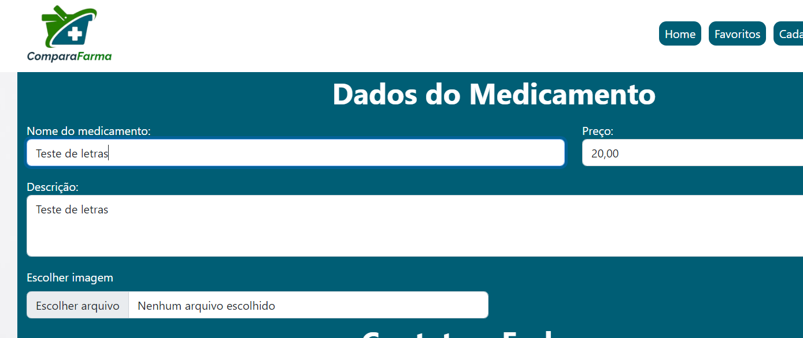

# Registro de Testes de Software

Pré-requisitos: <a href="3-Projeto de Interface.md"> Projeto de Interface</a>, <a href="8-Plano de Testes de Software.md"> Plano de Testes de Software</a>

<!--
Relatório com as evidências dos testes de software realizados no sistema pela equipe, baseado em um plano de testes pré-definido.
.-->

No quadro a seguir são apresentados os Casos de testes realizados e seus repectivos resultados dos testes.

| Casos de testes | Funcionalidade avaliada | Usuários participantes | Entrada testada | Saída esperada | Saída real do sistema | Registro de execução
|------|---------------------|--------------------|------------------------|--------------------------|------------------------|--------------------------|
| CT-01 | Capacidade de a página home vincular à página de cadastro de medicamentos quando ocorrer o clique no botão "cadastro de medicamentos" | Sr. Marcos Castro, proprietário de farmácia | Clique no botão "cadastrar medicamentos" | Abertura da página de cadastro de medicamentos | A página de cadastro de medicamentos foi aberta corretamente |  |
| CT-02 | Aceite de entrada de dados em todos os campos da página de cadastro de medicamentos | Sr. Marcos Castro, proprietário de farmácia | Inserção dos dados nos campos da página citada | Confirmar cadastro realizado com sucesso | Foi possível finalizar o cadastro. |   |
| CT-03 | Upload de arquivo de imagem do medicamento | Sr. Marcos Castro, proprietário de farmácia | Clique em "escolher arquivo" e busca do arquivo no repositório do usuário | Escolha do arquivo e sua anexação | Foi possível anexar o arquivo teste.  |  |
| CT-04 | Aceite e rejeição de caracteres válidos e inválidos nos campos da página de cadastro de medicamentos | Sr. Marcos Castro, proprietário de farmácia | Teste de lançamento de letras, números e caracteres especiais nos campos |	Aceite de entrada e rejeição de entrada de acordo com o que se espera de preenchimento em cada campo | Os campos para números não aceitam letras. Os campos para letras aceitam números e letras.   |  |

## Avaliação

Discorra sobre os resultados do teste. Ressaltando pontos fortes e fracos identificados na solução. Comente como o grupo pretende atacar esses pontos nas próximas iterações. Apresente as falhas detectadas e as melhorias geradas a partir dos resultados obtidos nos testes.

> **Links Úteis**:
> - [Ferramentas de Test para Java Script](https://geekflare.com/javascript-unit-testing/)
